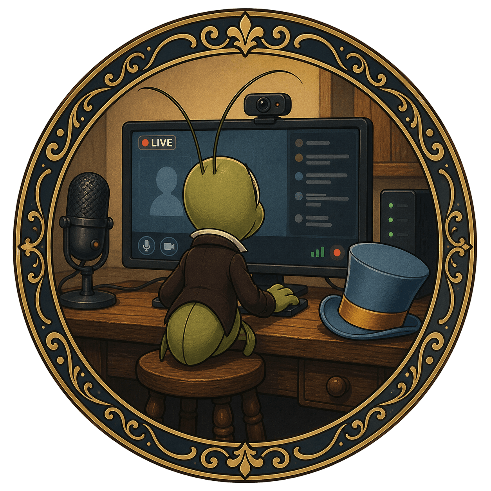

> *"Jiminy Cricket!" — what you say when the video call finally works.*

  

# Streaminy-Cricket

A self-hosted video conferencing app built on **mediasoup** (SFU architecture). Supports camera, microphone, and screen sharing with simulcast video, a dedicated streamer/viewer role split, and built-in observability.

---

## Features

- SFU routing via mediasoup (no peer-to-peer mesh scaling issues)
- Simulcast video (2 quality layers: 300 kbps / 800 kbps)
- Roles: **watcher** (camera + mic), **viewer** (receive only), **streamer** (broadcast only)
- Screen share routed to a separate grid
- Duplicate peer eviction on reconnect (stable `clientId` in `sessionStorage`)
- Exponential backoff reconnect (1 s → 16 s, up to 5 attempts)
- Room password protection
- Prometheus metrics + Grafana dashboard
- Docker Compose deployment

---

## Quick start (local dev)

```bash
cd server
cp .env.dist .env        # edit ANNOUNCED_IP and ROOM_PASSWORD
node src/index.js
```

Open `http://localhost:3000`.

> Cameras require HTTPS or `localhost`. On a remote dev machine use an SSH tunnel or set up a reverse proxy with TLS.

Optional room and role URL params:

```
http://localhost:3000?room=myroom          # custom room ID (default: "main")
http://localhost:3000?streamer=1           # join as streamer
http://localhost:3000?viewer=1            # join as viewer (receive only)
```

---

## Docker deployment

### 1. Configure environment

```bash
cp .env.dist .env
# edit .env — set ANNOUNCED_IP, ROOM_PASSWORD, TURN_* at minimum
```

### 2. Configure coturn (optional but recommended for production)

```bash
cp docker/turnserver.conf.dist docker/turnserver.conf
# edit docker/turnserver.conf — set external-ip, allowed-peer-ip, user credentials
```

### 3. Start

```bash
docker compose up -d --build
```

App available at `http://YOUR_PUBLIC_IP:3000`.

### Firewall — required open ports

| Port(s) | Protocol | Purpose |
|---------|----------|---------|
| 80 / 443 | TCP | HTTP / HTTPS (nginx) |
| 3000 | TCP | app (if not behind nginx) |
| 3478 | TCP + UDP | TURN (coturn) |
| 49160–49200 | TCP + UDP | coturn relay ports |
| 50000–50200 | TCP + UDP | mediasoup WebRTC transports |

### HTTPS via nginx + Let's Encrypt (recommended)

Proxy `https://your-domain` → `http://127.0.0.1:3000` with WebSocket upgrade headers:

```nginx
proxy_set_header Upgrade $http_upgrade;
proxy_set_header Connection "upgrade";
```

---

## Observability

```bash
docker compose -f docker-compose.observability.yml up -d
```

| Service | URL | Default login |
|---------|-----|---------------|
| Prometheus | `http://localhost:9090` | — |
| Grafana | `http://localhost:3001` | admin / `GF_ADMIN_PASSWORD` |

Set `GF_ADMIN_PASSWORD` in `.env` (default: `admin`).

---

## Environment variables

Copy `.env.dist` → `.env` at the project root for Docker, or `server/.env.dist` → `server/.env` for local dev.

| Variable | Default | Description |
|----------|---------|-------------|
| `ANNOUNCED_IP` | auto-detect LAN IP | Public IP clients connect to — **must set in production** |
| `PORT` | `3000` | HTTP + WS listen port |
| `LISTEN_IP` | `0.0.0.0` | Bind address |
| `ROOM_PASSWORD` | _(none)_ | Required password for all join-room calls |
| `ROOM_MAX_PARTICIPANTS` | `10` | Per-room participant cap |
| `ENABLE_UDP` | `true` | Set `false` for TCP-only (behind strict NAT) |
| `WORKER_RTC_MIN_PORT` | `40000` | mediasoup worker UDP port range start |
| `WORKER_RTC_MAX_PORT` | `49999` | mediasoup worker UDP port range end |
| `WEBRTC_MIN_PORT` | `49160` | WebRTC transport port range start |
| `WEBRTC_MAX_PORT` | `49200` | WebRTC transport port range end |
| `TURN_SERVERS` | Google STUN only | JSON array of ICE server objects |
| `TURN_USERNAME` | — | Applied to TURN entries missing credentials |
| `TURN_CREDENTIAL` | — | Applied to TURN entries missing credentials |
| `TURN_FALLBACK_URL` | — | Single fallback TURN URL |
| `GF_ADMIN_PASSWORD` | `admin` | Grafana admin password |

---

## Architecture

```
server/src/
  config.js       – env-driven config; TURN server parsing
  roomManager.js  – mediasoup room/peer/transport/producer/consumer lifecycle
  metrics.js      – Prometheus metrics via prom-client
  index.js        – HTTP server (serves client/) + WebSocket signaling

client/
  app.js          – vanilla JS + mediasoup-client (loaded from esm.sh CDN)
  index.html
  styles.css
```

WebSocket signaling: all messages carry `{ type, requestId, data }`. Consumers are created paused and need an explicit `resume-consumer` call.

### Simulcast layers

| Layer | Max bitrate | Max framerate | Scale |
|-------|------------|---------------|-------|
| `r0` (low) | 300 kbps | 20 fps | 2× down |
| `r1` (high) | 800 kbps | 30 fps | full res |

---

## Tech stack

- **Backend**: Node.js, [mediasoup](https://mediasoup.org/) SFU, `ws` WebSocket server
- **Frontend**: Vanilla JS, [mediasoup-client](https://github.com/versatica/mediasoup-client) via CDN
- **TURN**: coturn (Docker)
- **Observability**: prom-client, Prometheus, Grafana
- **Deployment**: Docker Compose, nginx reverse proxy
